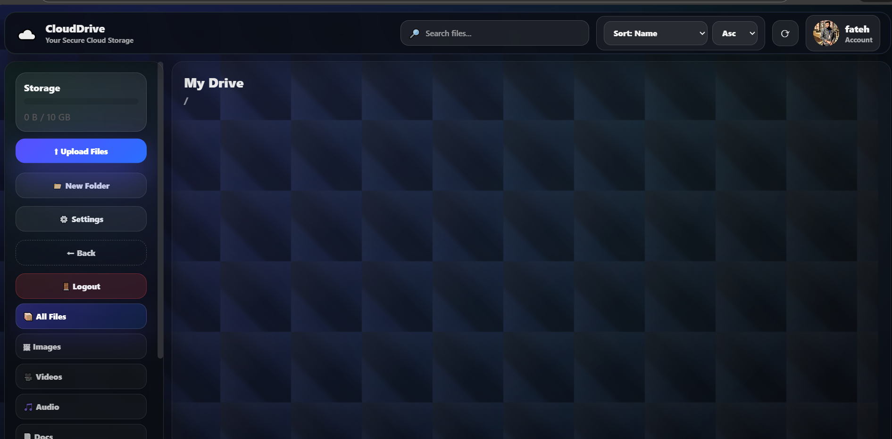
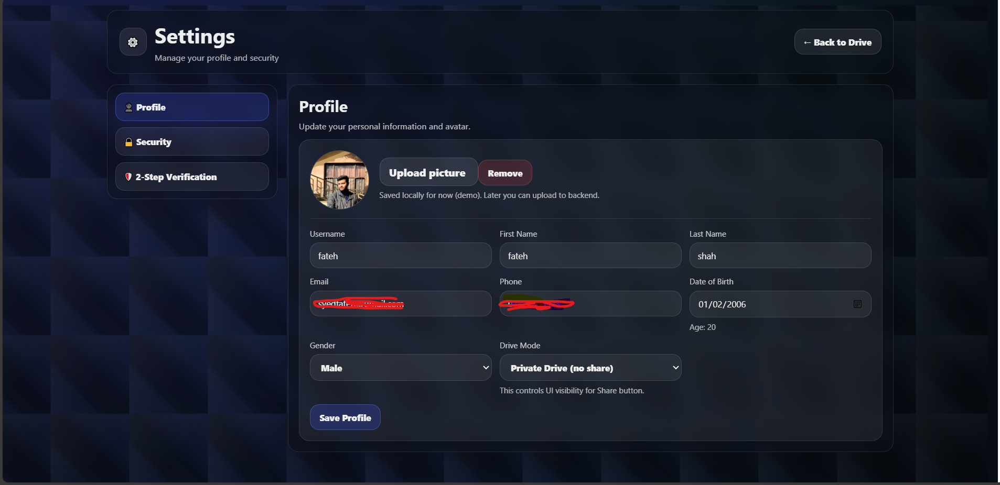
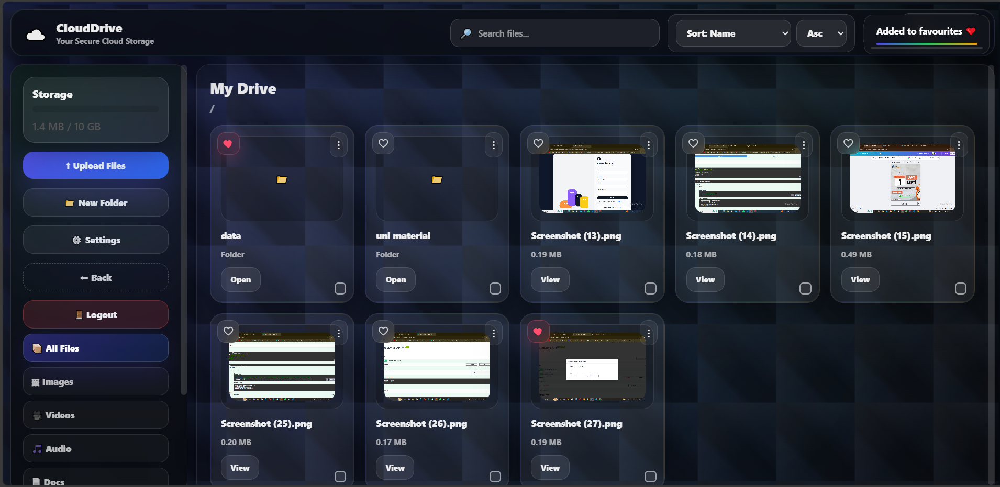

# ☁️ CloudDrive – Cloud Storage Management System

A secure and user-friendly **Cloud Storage Management System** built using **Python + Flask**.  
This project provides cloud-like functionality where users can **upload, download, manage, and organize files** through a modern drive-style interface.

---

## 📖 Project Overview

| Item | Details |
|------|---------|
| **Project Name** | CloudDrive – Cloud Storage Management System |
| **Project Type** | Full-Stack Web Application (Cloud Drive Clone) |
| **Inspired By** | Google Drive, Dropbox, OneDrive |
| **Tech Stack** | Python (Flask), HTML, CSS, JavaScript |
| **Main Functionality** | Cloud-like platform for storing, managing, organizing, and browsing user files |
| **User Features** | Signup/Login, Personal Drive Dashboard, Profile & Settings |
| **File Management** | Upload, Download, Delete, Rename, Favorites, Folder Organization |
| **Drive Interface** | Search, Sorting, File Categories (Images, Videos, Docs, Audio) |
| **Security Layer** | Authentication + user-specific access (more improvements planned) |
| **Storage System** | Local server-based storage (extendable to DB / Cloud) |

---

## ⚙️ Technical Highlights

This project was developed as a practical implementation of a real-world **Cloud Storage Platform**.

### ✅ Backend Engineering (Flask)
- User authentication (Signup/Login)
- File handling logic (upload/download/delete)
- API-style routes for managing files and folders
- Modular backend structure

### ✅ Cloud-Style File Management
- Drive-like file browsing with categories (Images/Videos/Docs/Audio)
- Folder creation and file organization
- Favorites feature for quick access

### ✅ Modern Full-Stack UI
- Responsive dashboard interface inspired by Google Drive
- Search and sorting for better file navigation
- Profile & settings page for user information
  
---

## ✅ Key Features

✅ User Registration & Login System  
✅ Secure File Upload & Download  
✅ Delete & Manage Stored Files  
✅ Folder Organization  
✅ Favorites (like) system 
✅ File Categories (Images / Videos / Audio / Docs)  
✅ Search + Sorting  
✅ Responsive Web Interface  
✅ Profile & Settings Page  

---

## 🖼️ Project Screenshots

### Login Page

### Dashboard (My Drive)

### Profile & Settings

### File Upload & Management

---

## 🚀 Future Enhancements

- Database Support (PostgreSQL / MySQL)
- Cloud Deployment (AWS / Render / Heroku)
- Role-Based File Sharing Permissions
- Activity Logs & Notifications
- Better security (tokens / OTP / email verification)

---

## 👨‍💻 Author

**Fateh Shah**  
Internship Project – CloudDrive (Cloud Storage Management System)  
GitHub: [fatehshah](https://github.com/fatehshah)

---

